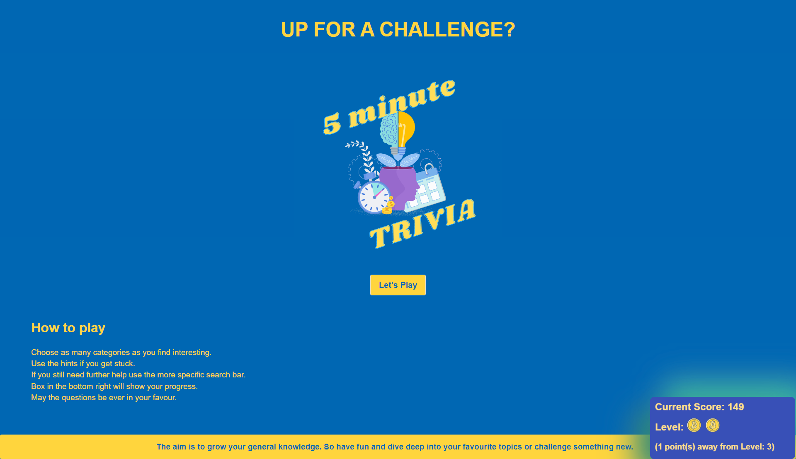
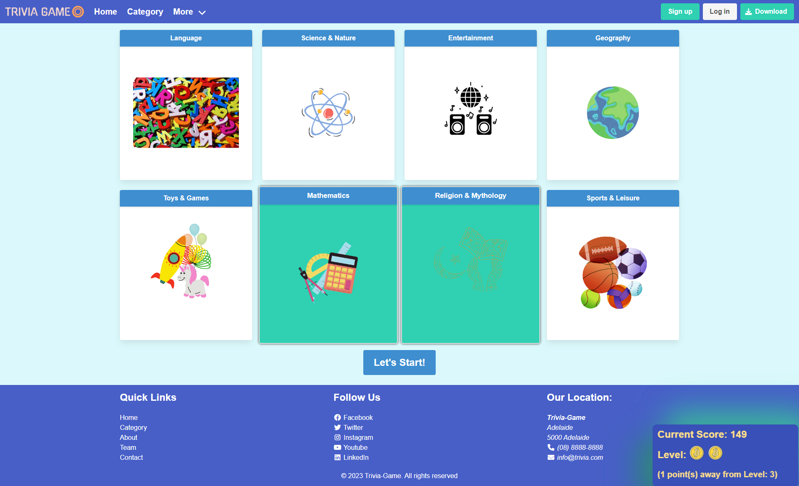
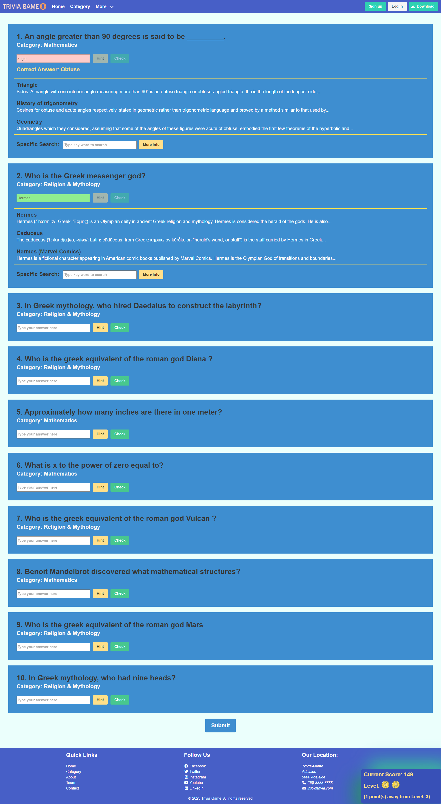

# Trivia-Games

## Made With

## Concept

This is an application for the individual who has limited spare time but is still interested in improving their knowledge. Whether they have five minutes on public transport, waiting for a meeting to start, the kids are entertaining themselves for once, or they have finally hit the couch after a long day-this is an application to casually improve your knowledge in short time sessions.

## Description
 The user is able to choose from a variety of categories to randomly generate a ten question test. If the user is unsure of the answer they have the option of using the "hint" button. This generates the top three Wikipedia searches related to the question. The user is then able to click any of the links to search for the answer on Wikipedia. There is also a specific search bar where the user can delve deeper into the wealth of knowledge provided by Wikipedia. The user can then check each individual answer. If correct the text entry box will turn green, if incorrect the text entry box will turn red and the correct answer will be given. The user then still has the option to use the specific search bar to learn more about the correct answer. Once the user has answered every question they can submit their test to recieve thier score. Every correct answer they get will accumulate and the user will move up a level every ten correct questions. The levels will be displayed by a gold coin for each level the user has surpassed.

## User Story

### AS a motivated but time poor person
* I WANT to take advantage of the small amounts of free time in the day
* SO THAT I can improve my knowledge in a casual, fun and easy manner.

## Problems Solved
A person would like to improve their knowledge but has limited time to do so. This is a casual, fun and easy way to do so in a small period of time. This application solves this problem by meeting the following acceptance criteria:

* GIVEN I want to improve my knowledge
* WHEN I have a limited amount of time
* THEN I can generate a short quiz to test my knowledge
* WHEN I want to improve my knowledge in specific areas
* THEN I can select from categories of interest
* WHEN I dont know an answer
* THEN I can easily get a hint to help me
* WHEN I find an answer or question intersting
* THEN I can quickly and easily find more information
* WHEN I answer a question incorrectly
* THEN I am given the correct answer and the opportunity to learn more about this answer
* WHEN I finish the quiz
* THEN I am provided with my results
* WHEN I come back to the application
* THEN I can see my accumulated score 
* WHEN I continue to use the application
* THEN I am able to progress through levels or stages

## Usage

The following images show the completed website. You can visit here: https://nileshpatel83.github.io/Trivia-Games/

 
## Contributors
Gary Gao https://github.com/Mid30s

Islam Mahammad https://github.com/TheIPM

Maxine Nel https://github.com/Maxie92

Nilesh Patel https://github.com/NileshPatel83

Tyler Leeming https://github.com/TLeeming15
## Installation

N/A

## License

MIT